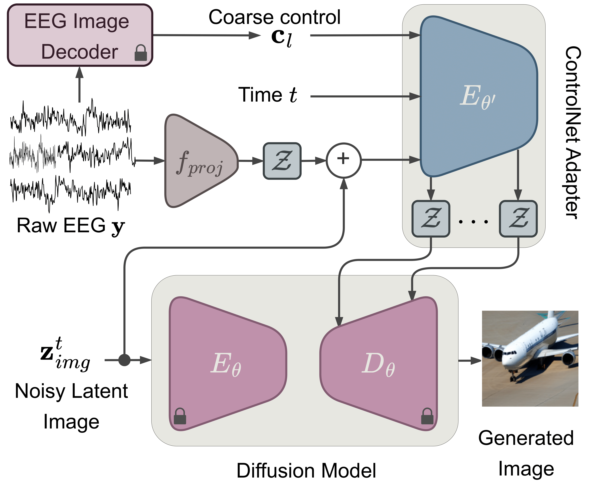

<h2 align="center"> <a href="https://arxiv.org/abs/2410.02780">[ICASSP 2025] Guess What I Think: Streamlined EEG-to-Image Generation with Latent Diffusion Models</a></h2>

<h3 align="center"><a href=""> Project page here 🚀</a></h3>

<div align=center></div>

<h5 align="center"> If you like our project, please give us a star ⭐ on GitHub for latest update.  </h2>


<h5 align="center">
     
 
[](https://arxiv.org/abs/2410.02780)
[]()

[](https://github.com/PKU-YuanGroup/LanguageBind/blob/main/LICENSE)
[](https://hits.seeyoufarm.com)


 <br>
</h5>

[Eleonora Lopez](), [Luigi Sigillo](https://luigisigillo.github.io/), [Federica Colonnese](), [Massimo Panella](https://massimopanella.site.uniroma1.it/) and [Danilo Comminiello](https://danilocomminiello.site.uniroma1.it/home)

[ISPAMM Lab](https://ispamm.it/) and [NESYA Lab](https://sites.google.com/view/nesya) , Sapienza University of Rome 

## 📰 News

* **[2024.12.25]** 🔥🔥🔥 Request the checkpoints available [here](https://forms.gle/9X2s7iHZvHYaQvMc6)!
* **[2024.12.25]**  Code is available now! Welcome to **watch** 👀 this repository for the latest updates.
* **[2024.12.20]**  The paper has been accepted for presentation at ICASSP 2025 🎉! 
* **[2024.09.17]**  The paper has been published on Arxiv 🎉. The pdf version is available [here]([https://arxiv.org/pdf/2412.11959](https://arxiv.org/abs/2410.02780))! 

## 😮 Highlights

### 💡 Revolutionizing Brain-Computer Interfaces (BCIs)
Our work bridges the gap between brain signals and visual understanding by tackling the challenge of generating images directly from EEG signals—a low-cost, non-invasive, and portable neuroimaging modality suitable for real-time applications.

### 🔥 State-of-the-Art EEG-to-Image Generation
We propose a streamlined framework leveraging the ControlNet adapter to condition a latent diffusion model (LDM) through EEG signals. Extensive experiments and ablation studies on popular benchmarks show our method outperforms state-of-the-art models while requiring only minimal preprocessing and fewer components.

### 👀 A Minimal yet Powerful Approach
Unlike existing methods that demand heavy preprocessing, complex architectures, and additional components like captioning models, our approach is efficient and straightforward. This enables a new frontier in real-time BCIs, advancing tasks like visual cue decoding and future neuroimaging applications.


## 🚀 Main Results

<div align=center></div>
<div align=center></div>

For more evaluation, please refer to our [paper](https://arxiv.org/abs/2410.02780) for details.

## How to run experiments :computer:

### Building Environment
```bash
conda create --name=gwit python=3.9
conda activate gwit
```


```bash
pip install src/diffusers
```

```bash
pip install transformers accelerate xformers==0.0.16 wandb numpy==1.26.4 datasets torchvision==0.14.1 scikit-learn torchmetrics==1.4.1 scikit-image pytorch_fid
```
### Train
To launch the training of the model, you can use the following command, you need to change the output_dir:
```bash
accelerate launch src/gwit/train_controlnet.py --caption_from_classifier --subject_num=4 --pretrained_model_name_or_path=stabilityai/stable-diffusion-2-1-base --output_dir=output/model_out_CVPR_SINGLE_SUB_CLASSIFIER_CAPTION --dataset_name=luigi-s/EEG_Image_CVPR_ALL_subj --conditioning_image_column=conditioning_image --image_column=image --caption_column=caption --resolution=512 --learning_rate=1e-5 --train_batch_size=8 --num_train_epochs=50 --tracker_project_name=controlnet --enable_xformers_memory_efficient_attention --checkpointing_steps=1000 --validation_steps=500 --report_to wandb --validation_image ./using_VAL_DATASET_PLACEHOLDER.jpeg --validation_prompt "we are using val dataset hopefuly"
```
You can change the dataset using one of, with the dataset_name parameter: 
- luigi-s/EEG_Image_CVPR_ALL_subj
- luigi-s/EEG_Image_TVIZ_ALL_subj

### Generate
Request access to the pretrained models from [Google Drive](https://forms.gle/9X2s7iHZvHYaQvMc6).

To launch the generation of the images from the model, you can use the following command, you need to change the output_dir:
```bash
python src/gwit/validate_controlnet.py --controlnet_path=output/model_out_CVPR_SINGLE_SUB_CLASSIFIER_CAPTION/checkpoint-24000/controlnet/ --caption --single_image_for_eval --guess
```

### Evaluation
Request access to the pretrained models from [Google Drive](https://forms.gle/9X2s7iHZvHYaQvMc6).

To launch the testing of the model, you can use the following command, you need to change the output_dir:
```bash
python src/gwit/evaluation/evaluate.py --controlnet_path=output/model_out_CVPR_SINGLE_SUB_CLASSIFIER_CAPTION/checkpoint-24000/controlnet/ --caption --single_image_for_eval --guess
```


## Dataset
The dataset used are hosted on huggingface: 

- [ImageNetEEG](https://huggingface.co/datasets/luigi-s/EEG_Image_CVPR_ALL_subj)
- [Thoughtviz](https://huggingface.co/datasets/luigi-s/EEG_Image_TVIZ_ALL_subj)


## Cite
Please cite our work if you found it useful:
```
@misc{lopez2024guessithinkstreamlined,
      title={Guess What I Think: Streamlined EEG-to-Image Generation with Latent Diffusion Models}, 
      author={Eleonora Lopez and Luigi Sigillo and Federica Colonnese and Massimo Panella and Danilo Comminiello},
      year={2024},
      eprint={2410.02780},
      archivePrefix={arXiv},
      primaryClass={cs.CV},
      url={https://arxiv.org/abs/2410.02780}, 
}
```

## Star History

[](https://star-history.com/#luigisigillo/GWIT&Date)
## Acknowledgement

This project is based on [diffusers](https://github.com/huggingface/diffusers). Thanks for their awesome work.
